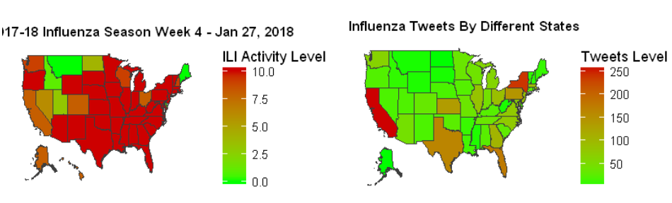

## Analyse Twitter reaction vs CDC surveillance report on influenza activity in US States. 

The project fetches the tweets on influenza and plots the heat map to compare how twitter reacted on influenza affected States. The complete project is implemented in R with the help of twitteR and geocode API for collecting tweets.

[TwtsVsCdsAnalysis.R](TweetsVsCdsAnalysis.ipynb)

