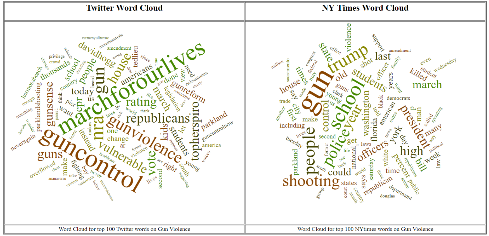
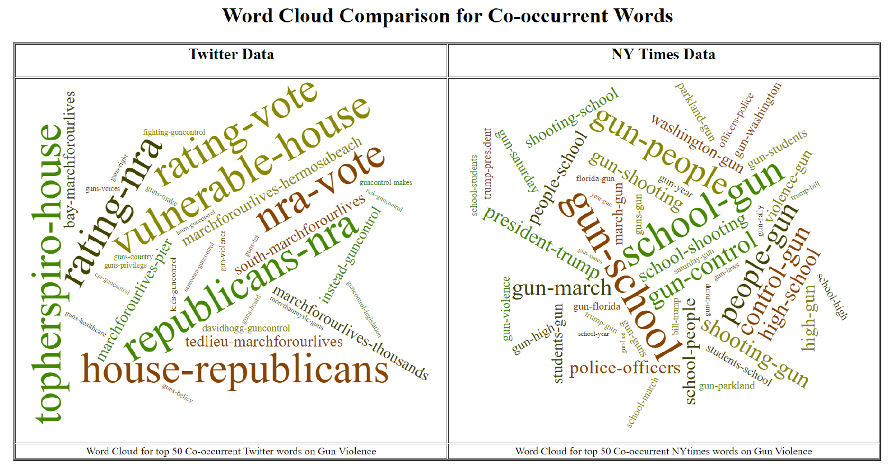

## Sentiment Analysis on Gun Violence using Hadoop.

Performed Sentiment analysis of People on gun violence on Twitter data and compared that with NYTimes articles. **Hadoop** is used to perform the word count and co-occurance of top words in two sets of data. I have used d3 for word-could and python to implement mapper and reducer of Hadoop framework.

[TopWordComp.html](SentimentAnalysis/d3_wordcloud/topwords-wordcloud.html)

[CooccurTopWordComp.html](SentimentAnalysis/d3_wordcloud/co-occur-wordcloud.html)

