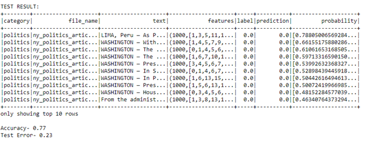
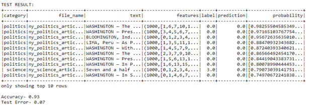

## Document Classification using Spark Infrastructure.

News articles can be from different categories like sports, business, etc. This project uses **Spark infrastructure with machine learning** to predict the category of articles. The first step is to train our model using the training set, test it, and finally predict the unknow set of articles and evaluate the performance of trained model.

[ArticleCollection Python Code](arcticles-collection.ipynb)

[DocumentClassification Python Code](document-classification.ipynb)

**Prediction Result:**

Prediction using Random Forest Classification-

Prediction using Logistic Regression Model

